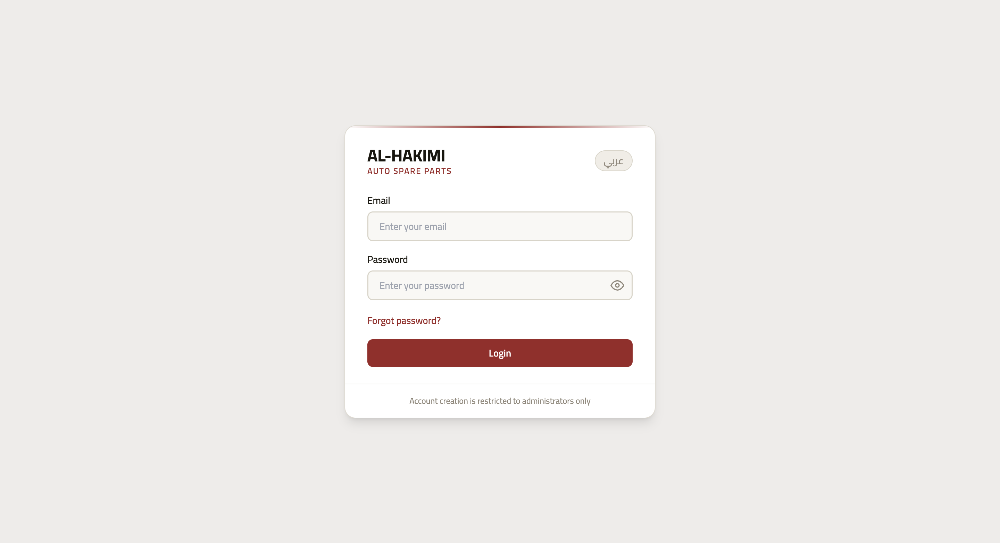
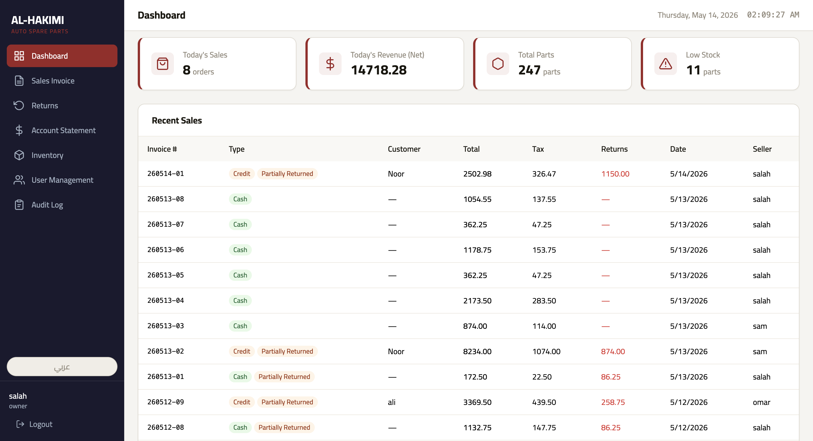
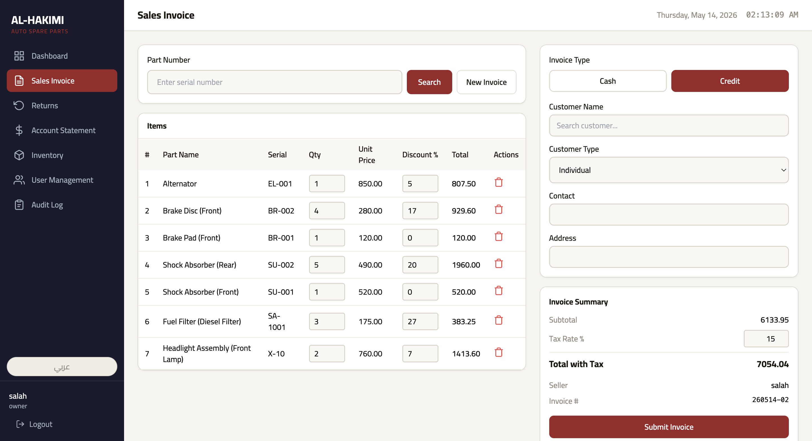
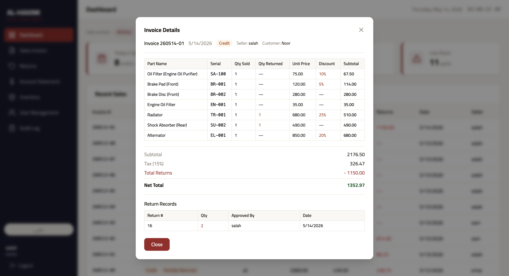
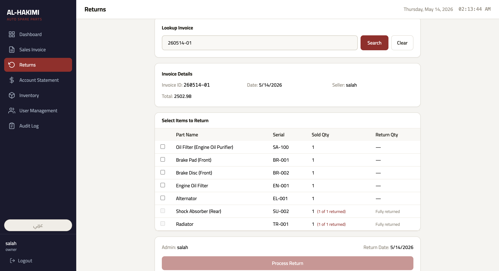
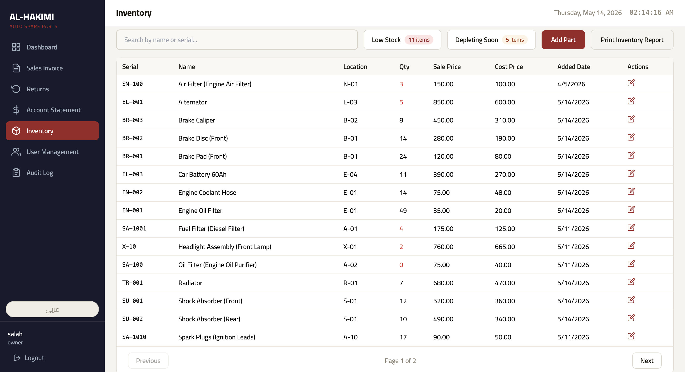
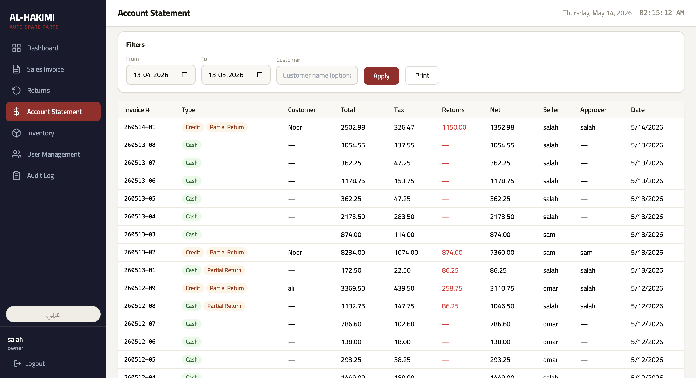

# AL-HAKIMI — Auto Spare Parts Management System

A web-based workstation application built to manage daily operations at an automotive spare parts store — from issuing invoices to tracking returns and monitoring inventory levels.

-----

## Screenshots

### Login


Clean login screen with bilingual support. Staff switch between Arabic and English from the same page.

-----

### Dashboard


At a glance: today’s orders, net revenue after returns, total parts in stock, and low stock alerts. The recent sales table shows invoice status, return badges, and seller names with pagination.

-----

### Sales Invoice


Workers look up parts by serial number and build the invoice item by item. Each part has its own quantity and discount field. The system blocks any discount that would bring the price below cost. Cash and credit invoices are both supported — credit invoices require customer details.

-----

### Invoice Details


Clicking any invoice opens a full breakdown: per-item discounts, returned quantities, tax, total returns deducted, and net total. Return records show who approved them and when.

-----

### Returns


Admins search by invoice number to pull up a sale, then select which items to return and how many. Fully returned items are locked. The system records the approving admin and the return date automatically.

-----

### Inventory


Full parts list with serial number, location, quantity, sale price, and cost price. Low stock items are highlighted in red. Two smart filters: Low Stock (≤10 units) and Depleting Soon (based on the last 30 days of sales velocity). Paginated for stores with large catalogs.

-----

### Account Statement


Owner-only view showing every invoice with its total, tax, returns, net amount, seller name, and return approver. Filterable by date range and customer name. Printable.

-----

## What the System Does

- Issues cash and credit invoices with per-item discounts
- Tracks returns per item with quantity validation and approval records
- Monitors inventory levels and predicts stock depletion
- Provides a full financial audit trail with seller and approver attribution
- Supports three access levels: Owner, Admin, and Worker
- Runs in Arabic and English with a single toggle

-----

## Access Levels

|Role  |What they can do                                      |
|------|------------------------------------------------------|
|Owner |Everything — including Account Statement and Audit Log|
|Admin |Sales, returns, inventory, and user management        |
|Worker|Sales invoices only                                   |

Each role sees a different time window in the dashboard (all time / 14 days / 3 days).

-----

## Tech Stack

- **Frontend:** React + Vite + Tailwind CSS
- **Backend:** Node.js + Express
- **Database:** PostgreSQL
- **Auth:** JWT with role-based middleware

-----

## Running the Project

You will need Node.js and a running PostgreSQL instance.

```bash
# Backend
cd backend
npm install
npm start

# Frontend
cd frontend
npm install
npm run dev
```

Create a `.env` file in the `backend/` directory with your database credentials and JWT secret. A sample `.env.example` is included.

-----

## Notes

- Designed for desktop use — internal store tool, no customer-facing interface
- Invoice numbers follow a daily-reset format: `YYMMDD-NN`
- Discounts are applied per item and validated against cost price on every sale
- All return operations are grouped into single records and tied to an approving admin